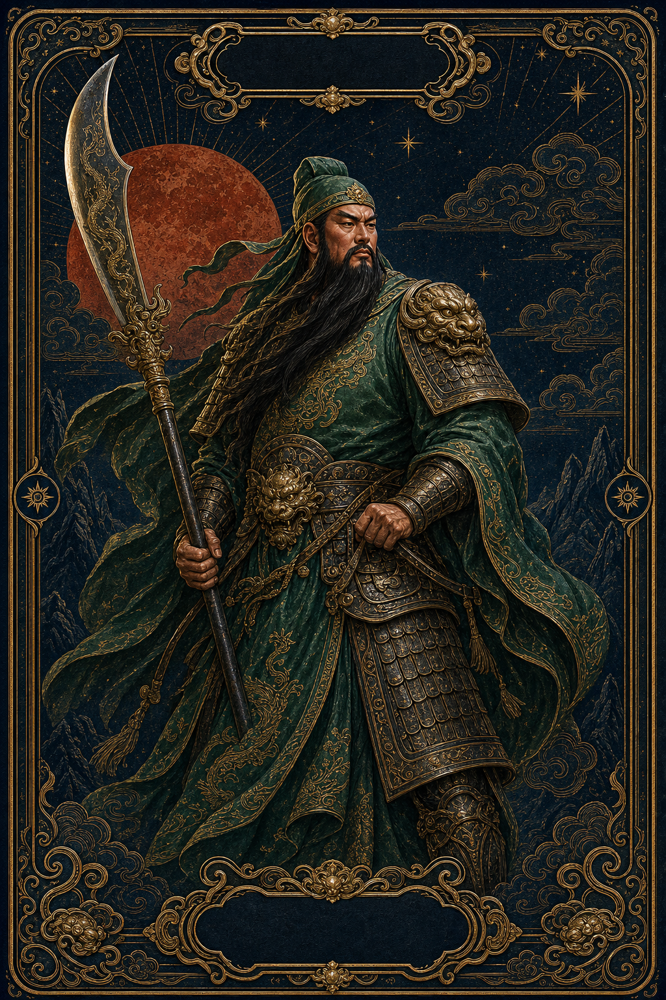
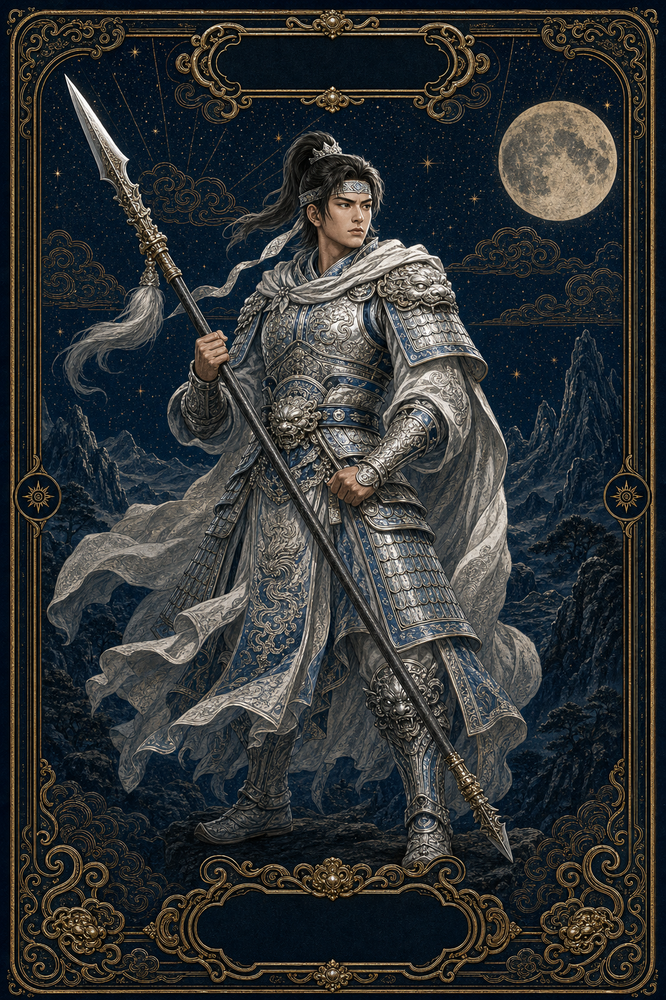
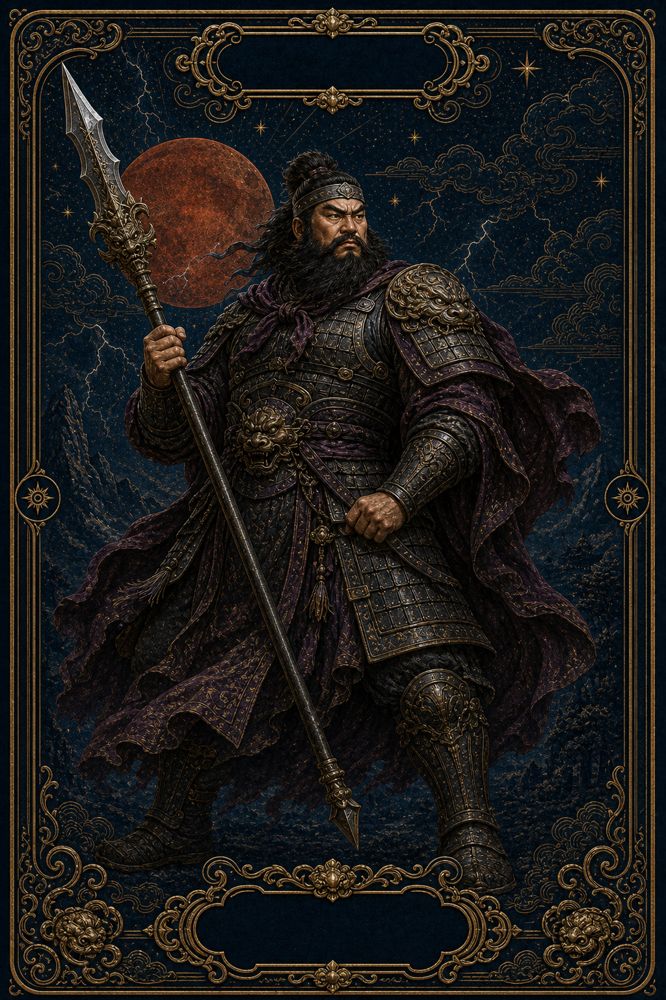
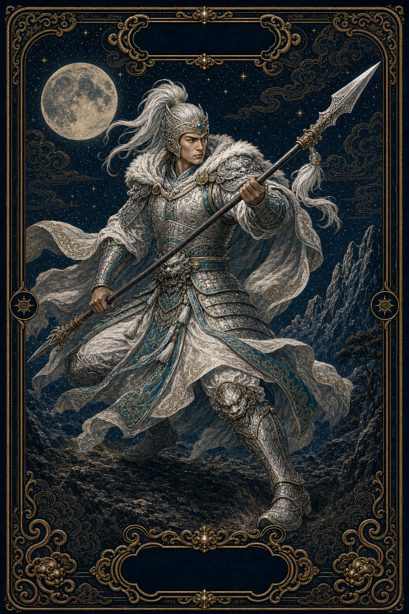
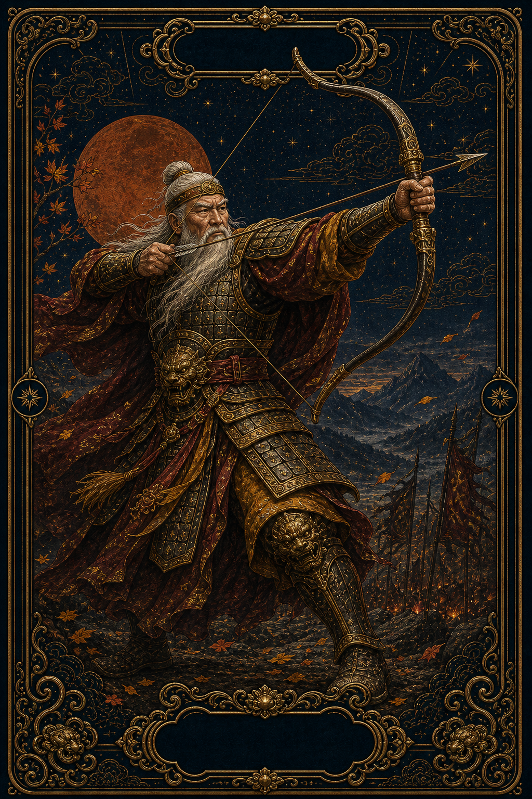
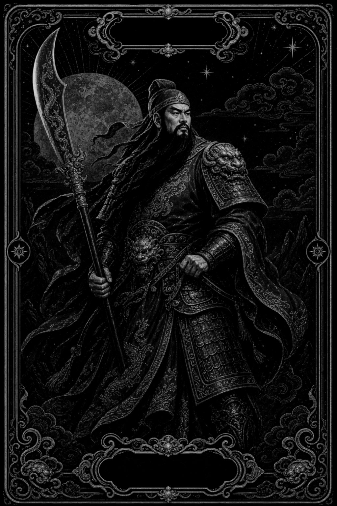
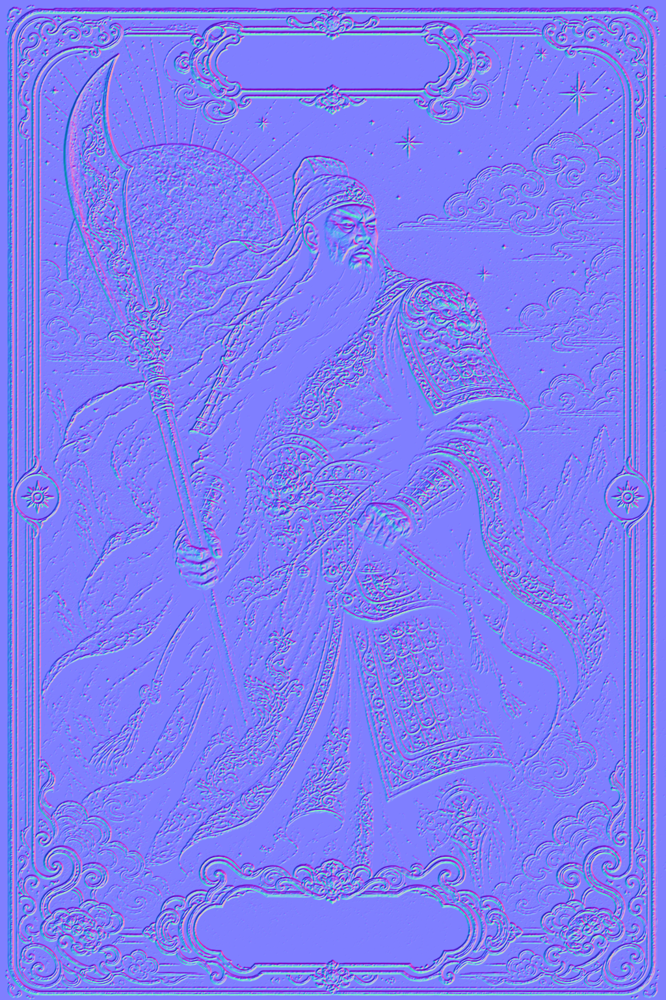
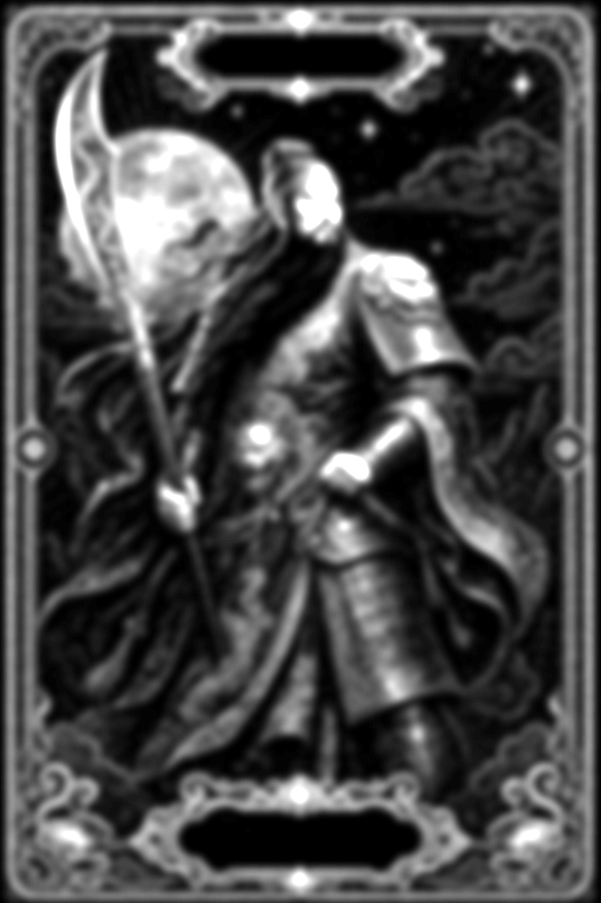

# 3D 材质卡牌 Skill

**简体中文** | [English](README_EN.md)

## 视频预览


https://github.com/user-attachments/assets/2c51023d-f7ad-4bd9-9f7d-6d1423a48b2a


一个用于生成交互式 3D / 2.5D 材质卡牌的 Codex Skill，适用于人物、收藏品、产品、游戏、展览与历史题材。

## 快速入口

- 🃏 **[立即体验五虎上将交互卡牌](https://mr-funny.github.io/five-tiger-generals-cards/)**
- 🎬 **[播放完整有声 `3d卡牌.mp4`](https://mr-funny.github.io/3d-material-cards-skill/preview/)**
- 🧩 **[查看可安装的 Skill 目录](3d-material-cards/)**
- 🌍 **[English documentation](README_EN.md)**

交互网站支持鼠标跟随倾斜、移动光源、金属高光、浮雕阴影、五位人物切换和实时渲染参数调节。

## 一键安装

### 方式一：在 Codex 中直接安装（推荐）

将下面这句话粘贴到 Codex：

```text
Use $skill-installer to install https://github.com/Mr-funny/3d-material-cards-skill/tree/main/3d-material-cards
```

Codex 会调用官方 Skill Installer，只下载仓库中的 `3d-material-cards` 标准 Skill 目录，并安装到 `$CODEX_HOME/skills`。

安装完成后，在 Codex 的下一轮对话或新任务中即可使用。

### 方式二：运行 Codex 官方安装脚本

```bash
python ~/.codex/skills/.system/skill-installer/scripts/install-skill-from-github.py \
  --url https://github.com/Mr-funny/3d-material-cards-skill/tree/main/3d-material-cards
```

### 方式三：让其他 AI Agent 自动安装

如果你使用的 AI Agent 支持 Agent Skills，可以粘贴：

```text
请安装这个 Agent Skill：https://github.com/Mr-funny/3d-material-cards-skill/tree/main/3d-material-cards
只复制 3d-material-cards 目录到你的 Skills 目录，然后加载其中的 SKILL.md。
```

不同 AI Agent 的 Skills 安装目录并不统一。Agent 应当将本仓库标准的 `SKILL.md`、`agents/`、`references/` 和 `scripts/` 结构映射到自己的 Skills 目录。

### 方式四：Codex 一条命令手动安装

```bash
git clone --depth 1 https://github.com/Mr-funny/3d-material-cards-skill.git \
  && mkdir -p "${CODEX_HOME:-$HOME/.codex}/skills" \
  && cp -R 3d-material-cards-skill/3d-material-cards "${CODEX_HOME:-$HOME/.codex}/skills/"
```


## 五虎上将人物画廊

| 关羽 | 赵云 | 张飞 | 马超 | 黄忠 |
| :---: | :---: | :---: | :---: | :---: |
| [](https://mr-funny.github.io/five-tiger-generals-cards/) | [](https://mr-funny.github.io/five-tiger-generals-cards/#collection) | [](https://mr-funny.github.io/five-tiger-generals-cards/#collection) | [](https://mr-funny.github.io/five-tiger-generals-cards/#collection) | [](https://mr-funny.github.io/five-tiger-generals-cards/#collection) |

五虎上将只是一套完整的工作流程示例。Skill 本身不限于三国或历史人物。

## 完整工作流程

Skill 会先完成一张卡牌，再开始下一张。这能避免批量生成导致的风格漂移，也便于逐张质检。

1. **检查目标项目**
   - 确认卡牌比例、素材命名、Shader 实现、现有美术方向和降级显示方案。
2. **确定系列风格**
   - 在生图前固定边框语言、材质、色板、光照氛围、构图规则和禁止项。
   - 中国历史浮雕卡可使用 `references/historical-card-style.md`。
3. **设计主体和动作**
   - 保留身份特征，并为每张卡选择不同的轮廓、动作、角度或产品朝向。
4. **生成单张完整正面图**
   - 使用内置 ImageGen 生成一张完整卡面。
   - 避免额外的透明前景人物、外部样机背景、意外文字、水印、裁切武器或重复主体。
5. **找回 ImageGen 结果**
   - 使用 `scripts/extract_image_result.py` 从 Codex Session JSONL 中解码已选中的 Base64 PNG。
6. **检查找回的正面图**
   - 检查解剖、身份、构图、材质区分、重要边缘、画幅比例和系列一致性。
7. **生成材质贴图**
   - 使用 `scripts/material_maps.py` 生成 height、normal、roughness 和模糊 parallax 贴图。
8. **验证素材集**
   - 确认正面图和所有贴图的宽高完全一致，并符合目标卡牌比例。
9. **集成 WebGL 材质**
   - 使用单一扁平卡面，结合 diffuse、normal、roughness、height 方向阴影和轻微的模糊 parallax。
10. **调节和验收**
    - 测试鼠标光照、边缘阴影、纹理稳定性、降级图片、移动端布局、减少动画模式和实时参数面板。
11. **加入卡牌集合**
    - 保留现有卡牌。只有当前卡牌通过质检后，才开始生成下一张。

## 过程素材

下面的关羽素材展示了交互式渲染器所使用的完整材质流程。

| 正面 / Diffuse | Height | Normal | Roughness | 模糊 Parallax |
| :---: | :---: | :---: | :---: | :---: |
|  |  |  |  |  |

| 素材 | 作用 |
| --- | --- |
| **正面 / Diffuse** | 提供最终可见的颜色、插画、边框和表面细节。 |
| **Height** | 表示细致浮雕高度，用于计算方向性自阴影。 |
| **Normal** | 编码每个像素的表面方向，让甲胄、纸张、雕刻和边框对光线产生不同反应。 |
| **Roughness** | 控制哑光纸张、布料、漆面、青铜和抛光黄金的高光差异。 |
| **模糊 Parallax** | 只提供宽泛且克制的 UV 移动。模糊处理可防止细节纹理出现游泳和位移。 |

### 建议的素材命名

```text
subject-front.png
subject-height.png
subject-normal.png
subject-roughness.png
subject-parallax.png
```

所有文件必须保持相同宽高。不要用细致 Height 贴图做强烈 UV 位移。

## 手动安装说明

### 环境要求

- 包含内置 ImageGen 的 Codex
- Git
- Python 3
- 运行 `material_maps.py` 时需要 Pillow 和 NumPy

### 1. 克隆仓库

```bash
git clone https://github.com/Mr-funny/3d-material-cards-skill.git
cd 3d-material-cards-skill
```

### 2. 复制到 Codex Skills 目录

```bash
mkdir -p ~/.codex/skills
cp -R 3d-material-cards ~/.codex/skills/
```

安装后的关键文件必须位于：

```text
~/.codex/skills/3d-material-cards/SKILL.md
```

### 3. 准备 Python 依赖

如果工作区已经提供 Pillow 和 NumPy，无需额外操作。否则可以建立隔离环境：

```bash
python3 -m venv ~/.codex/venvs/3d-material-cards
~/.codex/venvs/3d-material-cards/bin/pip install pillow numpy
```

手动执行材质贴图脚本时，使用该环境的 Python 可执行文件。

### 4. 验证安装

```bash
test -f ~/.codex/skills/3d-material-cards/SKILL.md \
  && echo "3d-material-cards installed"
```

新建一个 Codex 任务以刷新 Skill 列表，然后输入：

```text
Use $3d-material-cards to create an interactive material-lit card for my subject.
```

### 更新 Skill

```bash
cd 3d-material-cards-skill
git pull
cp -R 3d-material-cards ~/.codex/skills/
```

## 脚本使用方法

### 从 Codex Session 中找回 ImageGen PNG

```bash
python 3d-material-cards/scripts/extract_image_result.py \
  --session /path/to/session.jsonl \
  --contains "target subject" \
  --output public/assets/subject-front.png
```

该脚本会选择最后一个匹配的内置 ImageGen PNG，并解码其 Base64 内容。

### 生成材质贴图

```bash
python 3d-material-cards/scripts/material_maps.py \
  --front public/assets/subject-front.png \
  --prefix public/assets/subject
```

将生成：

```text
public/assets/subject-height.png
public/assets/subject-normal.png
public/assets/subject-roughness.png
public/assets/subject-parallax.png
```

## 调用示例

```text
Use $3d-material-cards to create a 2:3 material-lit card for a cyberpunk detective.
```

```text
Use $3d-material-cards to convert this existing product card into a WebGL material card with subtle pointer tilt.
```

```text
Use $3d-material-cards to add one new historical figure to this collection while preserving its visual system.
```

```text
Use $3d-material-cards to derive height, normal, roughness, and parallax maps from this approved front image.
```

## 已验证的渲染参数

| 参数 | 数值 |
| --- | ---: |
| 明暗对比 | 1.08 |
| 环境亮度 | 0.63 |
| 暖光强度 | 0.23 |
| 金属高光 | 0.71 |
| 浮雕强度 | 0.26 |
| 浮雕阴影 | 0.48 |
| 阴影范围 | 0.00180 |
| 纹理位移 | 0.00035 |
| 上下幅度 | 0.5 px |
| 摆动速度 | 0.00110 |
| 静止摇曳 | 1.85° |
| 倾斜灵敏度 | 12.0° |

这些数值是安全的初始参数，不是强制限制。建议在项目中将其暴露为实时可调控件。

## Skill 目录标准

可安装的 Skill 目录保持精简：

```text
3d-material-cards/
├── SKILL.md
├── agents/
│   └── openai.yaml
├── references/
│   └── historical-card-style.md
└── scripts/
    ├── extract_image_result.py
    └── material_maps.py
```

仓库文档、视频、人物画廊和过程素材位于 Skill 目录外部，因此不会占用 Skill 的模型上下文。

## 验证状态

- 官方 `quick_validate.py`：通过
- `SKILL.md`：64 行，低于建议的 500 行上限
- Frontmatter：仅包含 `name` 和 `description`
- 文件夹名称和 Skill 名称：完全一致
- `agents/openai.yaml`：验证通过
- Python 脚本：编译和执行成功
- 材质贴图输出：height、normal、roughness 和 parallax 均已在 1024×1536 尺寸下验证

## 常见问题

- **Skill 没有出现：** 复制文件夹后新建一个 Codex 任务。
- **出现 `ModuleNotFoundError: PIL` 或 `numpy`：** 安装 Pillow 和 NumPy，或使用工作区的内置 Python 运行时。
- **纹理出现游泳：** 降低 Parallax，并确认是模糊 Parallax 贴图而不是细致 Height 贴图在控制 UV 移动。
- **卡牌看起来很平：** 检查 Normal 方向、Canvas 设备像素比、环境光和高光强度。
- **GitHub 文件页无法播放 MP4：** 使用 README 中链接的 GitHub Pages HTML5 播放器。

## License

MIT
