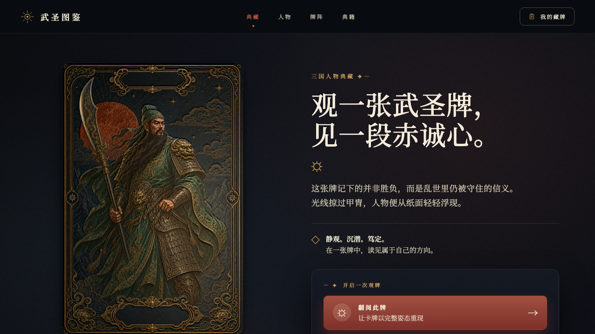

# 3D Material Cards Skill

A reusable Codex skill for creating premium interactive 3D and 2.5D material-lit cards for characters, collectibles, products, games, exhibitions, and historical subjects.



▶ [Preview the interactive 3D card video](preview/3d卡牌.mp4)

The Guan Yu card above is one demonstration of the workflow. The skill itself is not limited to Three Kingdoms or historical characters.

## What it includes

- A disciplined one-card-at-a-time production workflow
- ImageGen result extraction from Codex session JSONL
- Height, normal, roughness and blurred parallax map generation
- A tested WebGL material and motion preset
- Guidance for stable pointer lighting without duplicated subjects or swimming textures
- An optional Chinese historical engraved-card style reference

## Install

Copy the skill directory into your Codex skills folder:

```bash
cp -R 3d-material-cards ~/.codex/skills/
```

Then invoke it with `$3d-material-cards`.

## Requirements

- Codex with the built-in image generation tool
- Python 3
- Pillow and NumPy for `scripts/material_maps.py`

## Repository layout

```text
3d-material-cards/
├── SKILL.md
├── agents/openai.yaml
├── references/historical-card-style.md
└── scripts/
```

## License

MIT
